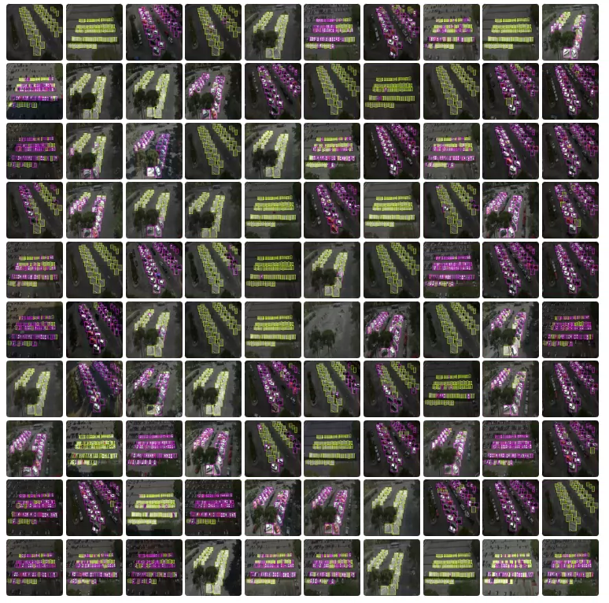
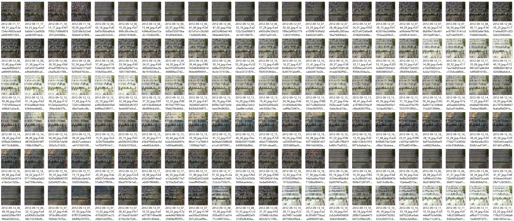
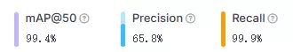
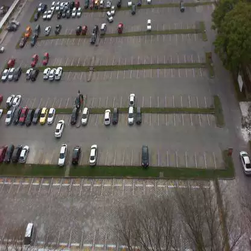
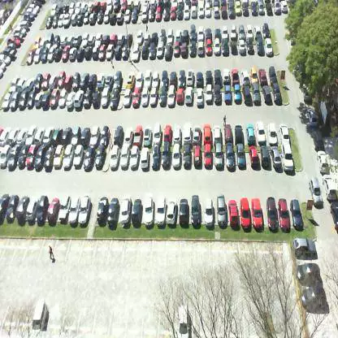

## Body

High-altitude parking lot spot situation detection dataset in YOLO format

Totally 12415 images, each labeled and divided into training set (8690), test set (1242), validation set (2483)

Divided into two categories, 'space-empty' and 'space-occupied'

Electronic virtual products sold without return or exchange.

## Images

item_1056977791555

Here is a pay link on Stripe ( https://buy.stripe.com/3cs8yP7sY87d0vu9AB ). Please contact me lonlonago@foxmail.com after funding $89, and I will send you a complete data files , thank you!

